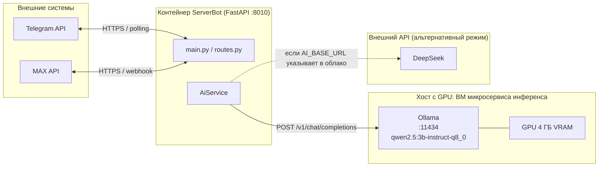

# Локальный ИИ-ассистент (микросервис инференса)

Автоответы в поддержке может выдавать как внешний API (DeepSeek), так и **локальная модель** —
отдельный микросервис инференса рядом с GPU-хостом. Код приложения при этом не меняется:
`AiService` обращается к OpenAI-совместимому эндпоинту `/chat/completions`, а значит переключение
источника «мозгов» — это две переменные в `.env`.

Зачем: переписка пользователей с поддержкой перестаёт уходить во внешний сервис.

## Схема



## Компоненты

| Компонент | Где развёрнут | Порт | Роль |
|---|---|---|---|
| `AiService` | внутри контейнера ServerBot | — | формирует запрос, хранит системный промпт |
| Микросервис инференса (Ollama) | GPU-хост, отдельная ВМ | `11434` | OpenAI-совместимый API, загрузка модели в VRAM |
| GPU | тот же хост | — | 4 ГБ VRAM, ~89% модели на карте, ~23 ток/с |

## Конфигурация

| Переменная | Локальная модель | Внешний API (DeepSeek) |
|---|---|---|
| `AI_ENABLED` | `true` | `true` |
| `AI_BASE_URL` | `http://<AI_HOST>:11434/v1` | `https://api.deepseek.com` |
| `AI_MODEL` | `qwen2.5:3b-instruct-q8_0` | `deepseek-chat` |
| `AI_API_KEY` | не нужен в доверенной сети; обязателен, если инференс опубликован наружу | ключ провайдера |
| `AI_SYSTEM_PROMPT` | задан в `config.py` (правила + примеры); можно переопределить в `.env` | то же |

`.env` в git не хранится — конкретные адреса и ключи живут только на сервере развёртывания.

## Как переключить источник

```bash
cd /opt/serverbot
cp .env .env.bak-$(date +%F)          # страховка

# → на локальную модель
sed -i 's|^AI_BASE_URL=.*|AI_BASE_URL=http://<AI_HOST>:11434/v1|' .env
sed -i 's|^AI_MODEL=.*|AI_MODEL=qwen2.5:3b-instruct-q8_0|' .env
sed -i 's|^AI_API_KEY=|# AI_API_KEY=|' .env

./update.sh                            # пересборка и перезапуск контейнера
```

Возврат к внешнему API — тем же способом, с восстановлением строк из бэкапа `.env`.

## Проверка

```bash
# 1. микросервис инференса отвечает
curl -s http://<AI_HOST>:11434/api/version

# 2. модель реально считает на GPU (доля VRAM)
curl -s http://<AI_HOST>:11434/api/ps

# 3. контейнер ходит именно туда
docker compose logs --tail 100 serverbot | grep chat/completions
```

Ожидаемая строка в логах контейнера:

```text
INFO:httpx:HTTP Request: POST http://<AI_HOST>:11434/v1/chat/completions "HTTP/1.1 200 OK"
```

Ручная проверка ответа модели:

```bash
curl -s http://<AI_HOST>:11434/v1/chat/completions \
  -H 'Content-Type: application/json' \
  -d '{"model":"qwen2.5:3b-instruct-q8_0","messages":[{"role":"user","content":"Что такое SMB?"}]}'
```

## Ограничения

- 4 ГБ VRAM — потолок: 7B-модель целиком не влезает (12–15% слоёв уходят на CPU и роняют скорость вчетверо).
- Выбранная модель — 3B в 8-битной точности: ~23 ток/с, стабильные русские ответы без выдумок на 8 проверочных сценариях.
- Качество ниже облачного: ассистент годится для типовых подсказок, но не для сложных разборов.
- Модель выгружается из VRAM после простоя; первый ответ после паузы на пару секунд медленнее.

## Когда контейнер API переедет на другой сервер

Проблема: микросервис инференса стоит в домашней сети, и «снаружи» к нему не достучаться напрямую.
Варианты подключения — от простого к правильному:

| Вариант | Как работает | Плюсы | Минусы |
|---|---|---|---|
| **Приватная сеть (WireGuard/Tailscale)** | новые хосты видят друг друга по стабильным внутренним адресам | нет проброса портов; трафик шифрован; адреса не меняются | нужно поставить агент на оба конца |
| **Обратный туннель** (`ssh -R`, Cloudflare Tunnel) | домашняя сторона сама открывает соединение наружу | не нужен белый IP и проброс портов | зависимость от туннеля; сложнее в отладке |
| **Публикация через reverse-proxy** (TLS + токен) | инференс открыт в интернет за nginx/Caddy с аутентификацией | просто вызывать откуда угодно | требует белый IP/DDNS, проброс портов, защиту от перебора |

**Рекомендуемая схема** (сочетает оба требования — доступность и безопасность):

1. Рядом с инференсом поднимается **AI-шлюз** — небольшой сервис, который принимает запросы,
   проверяет токен, ограничивает частоту и размер контекста, пишет логи и (в будущем) добавляет RAG.
2. Наружу публикуется **только шлюз**, и только внутри приватной сети или через туннель.
   Сам Ollama остаётся доступен лишь на самом GPU-хосте.
3. На стороне ServerBot меняется ровно одна строка — `AI_BASE_URL` на адрес шлюза;
   `AI_API_KEY` становится осмысленным (токен шлюза).

Такая схема даёт ещё и запас на будущее: политику промптов, кэш ответов и RAG удобнее развивать
в шлюзе, не трогая код приложения.

### Чеклист миграции API на новый сервер

1. На новом сервере поднять окружение и задеплоить ServerBot (`docker compose`).
2. Выбрать способ доступа к домашнему инференсу (см. таблицу выше) и настроить его.
3. Прописать в `.env`: `AI_BASE_URL` (адрес шлюза/туннеля), при необходимости `AI_API_KEY`.
4. Проверить связность: `curl` до `/v1/chat/completions` с нового сервера.
5. Проверить живой диалог: сообщение боту → ответ ассистента → ответ в мессенджер.
6. Убедиться, что исходящие в Telegram/MAX по-прежнему работают (прокси не требуется на стороне сервера).
7. Зафиксировать в документации проекта итоговый адрес эндпоинта (без чувствительных данных).

## Эксплуатация

- Микросервис инференса поднимается вместе с ВМ — стоит включить автозапуск ВМ на гипервизоре,
  иначе после перезагрузки хоста ассистент молча отвалится.
- Адрес ВМ лучше закрепить (статический IP или резервация DHCP): при смене адреса связь теряется,
  а в логах это выглядит как «модель недоступна» без явной причины.
- Диагностика «ассистент не отвечает»: сначала доступность эндпоинта (`/api/version`),
  затем доля модели на GPU (`/api/ps`), затем логи контейнера ServerBot.
