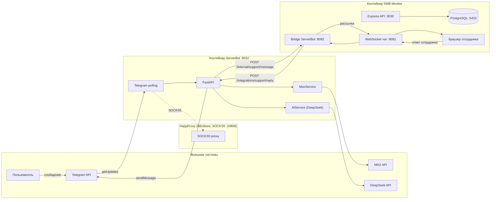

# Сетевая карта системы

Общая схема сетевых связей и модулей двух контейнеров: **ServerBot** (шлюз мессенджеров) и **SMB Monitor** (веб-приложение с чатом поддержки).

## Диаграмма



## Направления трафика

| Из | В | Протокол / порт | Назначение |
|----|----|-----------------|------------|
| Telegram API | ServerBot polling | HTTPS (через SOCKS5 `:10808`) | получение сообщений |
| ServerBot | SMB Monitor bridge | HTTP `:8082` | передача обращения в чат |
| Bridge | WebSocket-чат | внутренний процесс | рассылка сотрудникам |
| WebSocket-чат | Браузер | WS `:8081` | доставка сообщений в UI |
| Браузер | WebSocket-чат | WS `:8081` | ответ сотрудника |
| Bridge | ServerBot | HTTP `:8010` | отправка ответа пользователю |
| ServerBot | Telegram API | HTTPS (через SOCKS5 `:10808`) | ответ пользователю |
| ServerBot | DeepSeek API | HTTPS `:443` | автоответ ИИ |
| ServerBot | MAX API | HTTPS `:443` | работа с MAX |
| Express API | PostgreSQL | TCP `:5432` | данные мониторинга |

## Порты

| Порт | Сервис | Где слушает |
|------|--------|-------------|
| 8010 | ServerBot FastAPI | контейнер ServerBot |
| 3030 | SMB Monitor Express API | контейнер SMB Monitor |
| 8081 | SMB Monitor WebSocket-чат | контейнер SMB Monitor |
| 8082 | SMB Monitor bridge ServerBot | контейнер SMB Monitor |
| 10808 | HappProxy SOCKS5 | Windows-хост (для Telegram) |
| 5432 | PostgreSQL | хост или отдельный контейнер |

## Ключевые модули

### ServerBot (`main.py`, `api/routes.py`, `services/*`)

- `TelegramService` — polling/webhook, команды, пересылка в bridge.
- `MaxService` — отправка сообщений и webhook MAX.
- `AiService` — автоответы DeepSeek.
- `routes.py` — REST API и обработчики webhook.

### SMB Monitor (`server.js`, `websocket_server.js`)

- `server.js` — Express API: авторизация, мониторинг, чат.
- `websocket_server.js` — WebSocket-чат `8081` и bridge `8082`.
- `js/chat.js` — клиент чата: вкладки, бейджи, отображение.

## Поток обращения пользователя

```text
1. Пользователь пишет боту (Telegram/MAX)
2. ServerBot получает сообщение (polling)
3. ServerBot отправляет в bridge :8082
4. Bridge рассылает сотрудникам через WebSocket :8081
5. (опционально) DeepSeek отвечает пользователю автоматически
6. Сотрудник отвечает в чате
7. Bridge отправляет ответ в ServerBot
8. ServerBot отправляет ответ пользователю в Telegram/MAX
```
